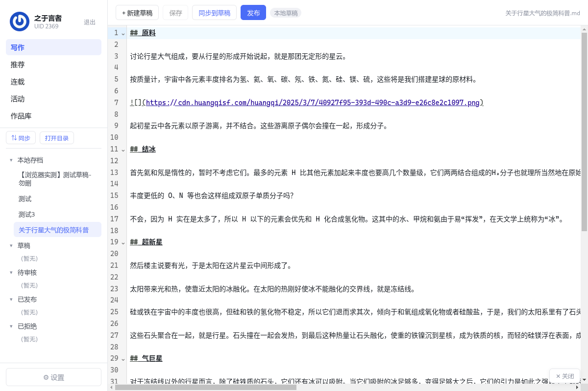

# 黄芪饮片桌面客户端（hq-scifi）

[](https://github.com/Kide-Lee/HQ-SciFi/releases)
[](LICENSE)
[](https://github.com/Kide-Lee/HQ-SciFi/releases)

> ⚠️ **第三方非官方客户端**：本项目为独立开发的桌面客户端，与「荒启科幻」官方无隶属关系。

[荒启科幻](https://www.huangqisf.com/h5/#/)（huangqisf.com）写作社区的桌面客户端，为**写作、阅读、评审**提供一站式体验。

本项目由由 [Reasonix](https://github.com/esengine/DeepSeek-Reasonix) AI 编码代理驱动的 [DeepSeek](https://github.com/deepseek-ai/) 模型全程参与开发。

## 功能特性

- **写作**：本地 Markdown 编辑（CodeMirror 6，自动保存 + Ctrl+S），草稿 / 待审核 / 已发布 / 已拒绝四态管理，一键与荒启草稿箱同步、发布；写作首页本地存档以文章卡片展示（文件夹组织 + 面包屑导航 + 按编辑时间 / 字数排序），删除移入系统回收站（可恢复），正文配图随同步下载到本地 `.image` 目录并在推送时自动上传
- **阅读**：推荐（精选 / AI 模型 / 首页置顶与内容流）、连载（推荐合集 / 推荐连载）、练笔活动（近期活动 / 活动树展开文章）、作品库五大栏目；正文安全净化渲染；列表排序支持评分 / 点赞 / 评论 / 阅读 / 字数 / 时间 / 回复，全部可倒序（↑/↓），并列排名同名次
- **评审**：接入官方五维评审体系（设定 / 文笔 / 人物 / 情节 / 思想性）；「我的评审 / 所有评审」双视图，可随时编辑自己的评审；所有评审按时间 / 评分 / 开心 / 有用 / 认真排序 + 倒序；评审栏与正文可拖动分栏（默认 1:2）、字号与正文一致、编辑框随内容自动增高、实时平均分预示、评者头像
- **活动**：活动按钮红点提示未完成评审任务；进行中 / 评审中活动带状态标记，且其文章不进入评分榜、不显示评分与排名
- **界面与交互**：无边框自绘顶栏（页面标题居中 / 窗口控件 / 返回列表，顶栏与左栏空白处可拖动窗口）；左栏可折叠、宽度可调（目录 / 文件树展开收起带动画）；阅读页右栏「目录 / 评论 / 评审」一体 tab，评论与评审双向联动（同一评审的评论聚合、跳转对应评审、回复评审），评审评论内嵌于评审卡片、态度反应 emoji 化；互动按钮悬浮文章右下角（投币 / 点赞 / 收藏 / 分享 + 置顶）；文章卡片高度统一、封面加载失败占位兜底、摘要区居中 / 无摘要提示
- **安全**：登录凭据经系统级加密（safeStorage）仅存主进程、渲染层沙箱隔离、远端内容白名单净化防 XSS；任意界面 Ctrl+F12 打开开发者工具

## 界面





## 安装

从 [GitHub Releases](https://github.com/Kide-Lee/HQ-SciFi/releases)（最新版本以 Releases 页为准）下载安装包：

| 平台 | 文件 |
| --- | --- |
| Windows | [hq-scifi.Setup.0.0.5.exe](https://github.com/Kide-Lee/HQ-SciFi/releases/download/v0.0.5/hq-scifi.Setup.0.0.5.exe) |
| Linux | [hq-scifi-0.0.5.AppImage](https://github.com/Kide-Lee/HQ-SciFi/releases/download/v0.0.5/hq-scifi-0.0.5.AppImage)（无需安装，直接运行） |
| Linux | [hq-scifi_0.0.5_amd64.deb](https://github.com/Kide-Lee/HQ-SciFi/releases/download/v0.0.5/hq-scifi_0.0.5_amd64.deb)（Debian/Ubuntu 系） |

> **v0.0.5**：写作体验大改——写作首页本地存档（文件夹组织 + 面包屑导航 + 按编辑时间/字数排序 + 摘要区居中 / 无摘要提示、删除移入系统回收站）、左栏递归文件树、文章配图随同步下载到本地并在发布时自动上传（`.image` 隐藏目录）；评审与评论卡片两行头部布局、评审态度 emoji 反应、评审评论并入评审卡片内嵌评论区；右栏收起展开动画、正文音乐不因边栏操作中断等；**v0.0.4**：无边框窗口与自绘顶栏（页面标题居中 / 窗口控件 / 返回列表）、左栏图标与折叠调宽、阅读页右栏 tab 化（目录 / 评论 / 评审）与评论-评审双向联动、互动悬浮按钮、写作首页本地存档、文章卡片统一高度、图片加载失败兜底等；**v0.0.3**：v0.0.2 样式改进交付（排序倒序 / 字数 / 并列排名、栏目首页、活动树与红点、评审「我的 / 所有评审」与编辑、拖动分栏、活动卡片统计等）；**v0.0.2**：修复 Windows 版无法打开界面的问题（Linux 交叉打包时原生模块 `better-sqlite3` 误打包为 Linux 版二进制，现自动注入 Windows 版 prebuild）。更新日志见 [doc/CHANGELOG.md](doc/CHANGELOG.md) 与 [Releases](https://github.com/Kide-Lee/HQ-SciFi/releases)。

### 从源码构建

环境要求：Node.js ≥ 20（建议 22 LTS）+ npm。

```bash
npm install
npm run dev          # 开发模式（热更新）
npm run dev:test     # 本地测试模式（独立 userData/API 配置/存档根，见下方说明）
npm run build:win    # 打包 Windows 安装包（dist/；自动注入 Windows 原生模块 prebuild）
npm run build:linux  # 打包 Linux（deb + AppImage，dist/）
npm run build:mac    # 打包 macOS（dmg + zip，x64 + arm64，dist/）
```

> **本地测试模式**（对接自建 RuleApi / 本地接口联调）：`npm run dev:test`（或 `electron out/main/index.js --test` / 环境变量 `HQSF_TEST=1`）。测试模式与正式使用完全隔离——独立 userData（`~/.config/hqsf-test`，数据库/session/设置不混入正式库）、API 配置优先读本地持有的 `api.config.test.json`（baseUrl 指向本地服务，不入库）、默认存档根为 `~/文档/荒启科幻/草稿-test`。正式模式（`npm run dev`）不受任何影响，两者可同时运行。

> Windows 包在 Linux 交叉打包时，`build:win` 会自动下载 better-sqlite3 的 Windows prebuild 替换原生二进制（打包后恢复），无需 Windows 环境；升级 Electron 后首次打包会重新下载匹配 ABI 的 prebuild（需联网访问 GitHub Releases）。
>
> macOS 的 dmg 打包依赖系统 hdiutil，**只能在 macOS 上执行** `build:mac`（Mac 真机或 CI 的 macos runner），Linux 无法交叉产出 mac 包。macOS 上 better-sqlite3 由官方 darwin prebuild 自动匹配，无需额外脚本。未配置 Apple 签名证书时产出未签名包，首次打开需右键 → 打开。

## 使用

1. 启动客户端，使用荒启账号登录（账号密码 / 手机验证码），登录后自动恢复会话、免重复登录
2. **写作**：左侧「写作」→ 新建草稿 → 编辑（自动保存）→ 「同步到草稿」或「发布」（发布后进入官方审核流程，审核通过即公开）
3. **阅读**：通过左侧栏目（推荐 / 连载 / 活动 / 作品库）浏览文章，点击卡片进入阅读
4. **评审**：打开他人文章 → 「✎ 评审这篇文章」→ 填写五维评分与评语 → 提交

## 官方渠道

- 官方网站：[荒启科幻](https://www.huangqisf.com/)
- 官方 QQ 群：**280660235**（[点此加群](http://qm.qq.com/cgi-bin/qm/qr?_wv=1027&k=6A1FVREgm38a7LrOMIF_I4A_peDk1RPH&authKey=DE8Pl0%2Fb9BnwXfPbTcV8N920c3BW4hlRZ84tnA47lG)）

## 文档

- [产品与技术设计](doc/design.md)
- [荒启 API 调查报告](doc/api-research.md)
- [荒启网站现状调研](doc/site-overview.md)

## 技术栈

Electron 34 · React 19 · TypeScript · Vite 7（electron-vite 5）· CodeMirror 6 · Zustand · better-sqlite3 · lucide-react（图标）· electron-builder 26

## 免责声明

- 本项目为第三方独立开发，非官方出品；请勿将本项目用于任何违反荒启科幻服务条款的用途。
- 站内文章等内容版权归原作者与平台所有，本客户端仅作本地管理与浏览工具。
- 请自行保管账号安全，遵守[荒启科幻](https://www.huangqisf.com/)的使用规则。

## License

[MIT](LICENSE) © 2026 之于言者
